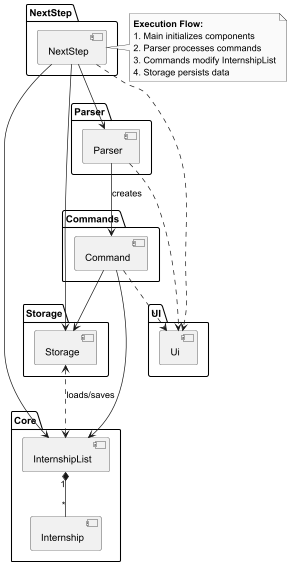
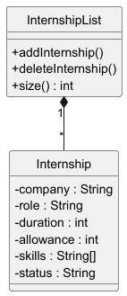
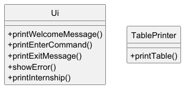
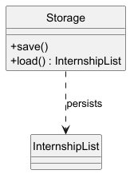
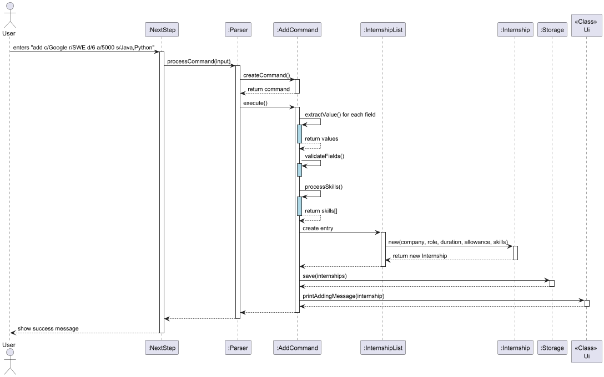
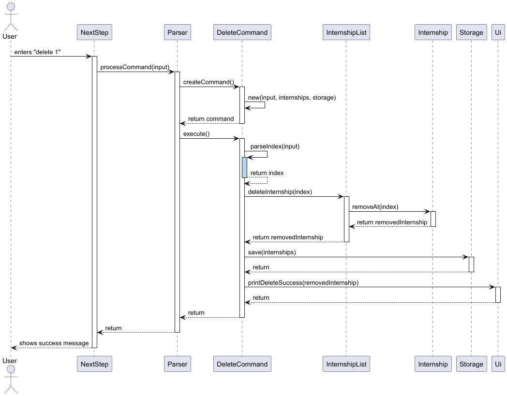

 # Developer Guide
- [Acknowledgements](#acknowledgements)
- [Setting up, Getting started](#Setting-up-getting-started)
- [Design](#design)
  - [Architecture](#architecture)
  - [UI Component](#ui-component)
- [Implementation](#implementation)
  - [Adding Internship](#adding-internship)
  - [Deleting Internship](#deleting-internship)
- [Appendix: Requirements](#appendix-requirements)
  - [Product Scope](#product-scope)
  - [User Stories](#user-stories)
  - [Use Cases](#use-cases)
  - [Non-Functional Requirements](#non-functional-requirements)
  - [Glossary](#glossary)
- [Appendix: Instructions for Manual Testing](#appendix-instructions-for-manual-testing)
  - [Launch and Basic Commands](#launch-and-basic-commands)
  - [Core Functionality Tests](#core-functionality-tests)

---
## Acknowledgements
- **JUnit:** Used for unit testing the NextStep application.
- **Gradle:** Utilized as the build tool to compile and manage dependencies.
- **PlantUML:** Employed to create UML diagrams for visualizing the design and architecture.

---
## Design
NextStep's architecture consists of the following few components:
- ```UI```: Responsible for user interactions, handles output to the user.
- ```Parser```: Interprets and executes user command.
- ```Commands```: Perform specific operations. *(eg. AddCommand, DeleteCommand)*
- ```Core```: Maintains current data state of NextStep.
- ```Storage```: Reads data from, and writes data to, the hard disk.



# NextStep Architecture Overview

The **NextStep Architecture** is designed to efficiently manage internship-related data while maintaining modularity and scalability. It consists of several key components that work together to process user commands, store and retrieve data, and present results in a user-friendly manner. The main components of this system include **NextStep (Main), Core (InternshipList & Internship), UI, Storage, Parser, and Commands.**

## 1. NextStep (Main Component)

The **NextStep component** serves as the central hub of the system, coordinating interactions between different modules. It ensures that commands are processed correctly, and data is stored, retrieved, and displayed effectively.

### Responsibilities:
- Acts as the main entry point for user interactions.
- Directs requests to the appropriate components (Parser, Storage, UI, and InternshipList).
- Ensures smooth execution of user commands.

## 2. Core (InternshipList & Internship)

The **Core** component contains the core data model, which consists of **InternshipList** and **Internship**. The **InternshipList** serves as the container for storing multiple internship data entries, while **Internship** represents individual internship records.



### Responsibilities:
- **InternshipList**: Stores all internship data.
- **Internship**: Represents individual internship details, such as job role, company, allowance, duration, skills, and status.

## 3. UI (User Interface)

The **UI** is responsible for interacting with the user. It displays information such as internship data, command results, and error messages. The UI acts as the front-end interface that communicates with the backend logic to display the processed data to the user.



### Responsibilities:
- Handles user interactions.
- Displays internship data and the results of executed commands.
- Provides a responsive and intuitive interface for the user.

## 4. Storage

The **Storage component** handles the persistence of data. It ensures that internship data is saved to a storage system and can be retrieved later when needed.



### Responsibilities:
- Saves and loads internship data to ensure persistence.
- Handles the storage of data when the application is closed or restarted.

## 5. Parser 

The **Parser** is responsible for processing user input. It reads and interprets the commands given by the user and directs them to the appropriate component to execute.

### Responsibilities:
- Reads and processes user commands.
- Determines which **Command** should be executed based on the user’s input.
- Interacts with **InternshipList**, **Storage**, and **UI** to execute the required action.

## 6. Commands

The **Commands** component contains various actions that users can perform, such as adding, deleting, finding, or filtering internships. These commands are implemented as individual classes, each responsible for a specific action.


### Responsibilities:
- Each command interacts with **InternshipList** to modify or retrieve data.
- Handles operations like **Add**, **Delete**, **Find**, and **Filter**.
- Commands are created by the **Parser** and executed based on user input.

---
## **Implementation**
This section describes how some noteworthy features are implemented.
### Adding Internship
The ```add``` command allows users to add new internships and requires the following fields:
- Company
- Role
- Duration
- Allowance
- Skills

Example input: ```add c/Google r/SWE d/6 a/5000 s/Java, Python ```

#### Implementation Flow
1. The user enters an ```add``` command along with the required fields.
2. The parser receives the command and creates a new AddCommand instance.
3. Once the new instance is created, ```AddCommand.execute()``` is invoked.
4. The ```execute()``` method extracts the values from the user input, validates them, and processes them if needed.
5. A new internship object is then created and added to the Internship List.
6. The updated list is saved into ```storage```.
7. A confirmation message is then printed to the user via the ```Ui``` class.

The sequence diagram below showcases the flow of execution:



#### Error Handling
Additionally, ```AddCommand``` implements various exception handling to deal with errors.
+ ```EmptyInputException```: Thrown when no details are provided after "add"
+ ```InvalidInputFormatException```: Thrown when required fields are missing
+ ```NumberFormatException```: Caught by the Parser when allowance/duration are not integers

### Deleting Internship
The `delete` command allows users to remove an existing internship from the Internship List by specifying its index.

Example input: ```delete 1```
#### Implementation Flow
1. The user enters a `delete` command with an index.
2. The parser receives the command and creates a new `DeleteCommand` instance.
3. Once the new instance is created, `DeleteCommand.execute()` is invoked.
4. The `execute()` method extracts the index from the user input, validates it (ensuring that:
    - An index is provided.
    - The index is a valid integer.
    - The index is within the bounds of the Internship List), and processes it if valid.
5. The internship corresponding to the specified index is then removed from the Internship List.
6. The updated list is saved into `storage` (if persistence is implemented).
7. A confirmation message is then printed to the user via the `Ui` class.

The sequence diagram below showcases the flow of execution:



#### Error Handling
Additionally, `DeleteCommand` implements various exception handling to deal with errors.
- `EmptyInputException`: Thrown when no index is provided after "delete".
- `InvalidIndexException`: Thrown when the index given is out of bounds.
- `NumberFormatException`: Thrown when the provided index is not a valid integer.

---
## Appendix: Requirements

### Product Scope
#### Target User Profile
- Undergraduate students in Singapore seeking internships
- Tech-savvy users who prefer keyboard-driven applications
- Candidates applying to multiple internships simultaneously
- Users who need to track application statuses systematically

#### Value Proposition
NextStep streamlines internship management for students by:
1. Centralizing all opportunities in one searchable platform
2. Eliminating manual spreadsheet maintenance
3. Allowing for easy addition, deletion, filtering of internships.

### User Stories

| Version | Priority | As a... | I want to...                        | So that I can...                         | 
|---------|----------|---------|-------------------------------------|------------------------------------------|
| v1.0    | Critical      | First-time user | See help instructions               | Learn how to use the application         |
| v1.0    | Critical | User | Add internship details              | Track opportunities I'm interested in    |
| v1.0    | Critical | User | Delete internship entries           | Remove irrelevant opportunities          |
| v2.0    | Critical | Student | View internships in table format    | Quickly assess all options               |
| v1.0    | Critical | Student | Find internships matching my skills | Identify relevant positions              |
| v2.0    | Critical | Student | Update application statuses         | Track my progress                        |
| v2.0    | Critical | User | Save internship data                | Retain information between sessions      |
| v2.0    | High    | Student | Edit internship details             | Correct mistakes efficiently             |
| v2.0    | High    | Student | Filter by salary/stipend            | Find financially viable options          |
| v2.0    | High    | Student | Filter by duration                  | Match my academic schedule               |
| v2.0    | High    | Student | Search by company name              | Target preferred employers               |
| v2.0    | High    | Student | Search by role                      | Find position-specific opportunities     |
| v2.0    | Medium  | Student | Search by skills                    | Find internships with relevant skillsets |

### Use Cases


**Use Case: Add New Internship**
1. User enters `add` command along with required fiels.
2. System validates and confirms successful addition, displaying success message.
5. Updated list displays automatically upon entering `list` command

**Use Case: Skill-Based Search**
1. User enters `find/s Java`
2. System scans all entries for matching skills
3. Returns formatted table of matching internships

### Non-Functional Requirements
1. **Performance**: Should respond to commands within 1 second for lists <100 entries
2. **Portability**: Must run on Windows/macOS/Linux without additional setup
3. **Data Safety**: Automatic daily backups of user data

### Glossary
* **CLI** - Command Line Interface: Text-based application control
* **Serialization** - Process of converting data for storage

---
## Instructions for Manual Testing

Before testing, ensure you have:
1. Java 17 installed

### Launch and Basic Commands
1. **Initial Launch**
   - Download the NextStep.jar file and copy it into an empty folder
   - Start the application by running `java -jar NextStep.jar`
   - Expected: Shows welcome message
   - Verify: `data/nextstep.txt` is created automatically

2. **Help Command**
   - Test case: `help`
   - Expected: Displays command summary in printed format
   - Verify: All commands in user guide are presented

### Core Functionality Tests
#### Adding Internships
1. **Normal Add**
   - Test case: `add c/Google r/SWE d/6 a/3000 s/Java,Python st/A`
   - Expected: Success message with added entry details
   - Verify: Entry appears in next `list` output

2. **Missing Fields**
   - Test case: `add c/Amazon`
   - Expected: Error highlighting missing required fields
   - Verify: No data file modification occurred

#### Listing Internships
1. **Basic List**
   - Test case: `list`
   - Expected: Displays all entries in formatted table
   - Verify: Column widths adjust to content length

#### Editing Entries
1. **Guided Edit**
   - Test case: `edit 1`
   - Expected: Prompts the user to edit a particular field in the first internship.
   - Verify: Fields are prompted based on what is required to be edited.

#### Deleting Entries
1. **Normal Delete**
   - Test case: `delete 1`
   - Expected: Deletes the first internship from the list.
   - Verify: `list` command no longer displays the selected internship.

#### Finding Entries
1. **Finding Company**
   - Test case: `find/c Google`
   - Expected: Displays all internships with "Google" as the company.
2. **Finding Role**
   - Test case: `find/r SWE`
   - Expected: Displays all internships with "SWE" as the role.
3. **Finding skill**
   - Test case: `find/s Java`
   - Expected: Displays all internships that contains "Java" as a skill.

#### Filtering Entries
1. **Filtering Allowance**
   - Test case: `filter/a 1000 5000`
   - Expected: Displays internships with allowances between \$1000 and $5000.
2. **Filtering Duration**
   - Test case: `filter/d 4`
   - Expected: Displays internships with duration equal to or above 4 months.

### File Operations
1. **Data Persistence**
   - Steps:
      1. Add several test entries
      2. Exit with `bye`
      3. Relaunch application
   - Expected: Previous entries load automatically
   - Verify: Entry counts match before/after restart

2. **Corrupt File Handling [To be implemented]**
   - Steps:
      1. Manually edit `nextstep.txt` to create syntax errors
      2. Launch application
   - Expected: Error message with recovery option
   - Verify: Backup file created automatically
